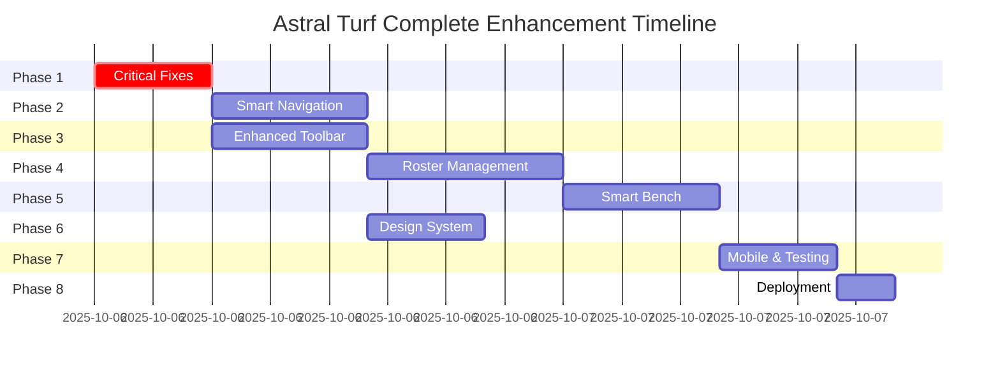

# 🎯 MASTER IMPLEMENTATION PLAN - Astral Turf Complete Enhancement

**Date**: October 6, 2025  
**Status**: Comprehensive Integration Plan  
**Priority**: Production-Ready Roadmap

---

## 📊 Executive Summary

This master plan integrates **two major workstreams**:

1. **Tactical Board Critical Fixes** - Essential bug fixes and TypeScript cleanup
2. **Navigation & UI Enhancement** - Complete UX modernization

**Current Status**: 35% Complete (Infrastructure fixes done)  
**Target**: Production-ready, modern football management system  
**Estimated Total Time**: 40-50 hours

---

## 🔥 PHASE 1: Critical Stabilization (CURRENT PRIORITY)

**Goal**: Fix all blocking issues and TypeScript errors  
**Duration**: 4-6 hours  
**Status**: ⏳ In Progress (50% complete)

### 1.1 Completed Runtime Fixes ✅
- [x] PositionalBench frozen object error (FIXED)
- [x] CSP policy violations (FIXED)
- [x] Missing CSP report endpoint (FIXED)
- [x] React duplicate key warnings (FIXED)

### 1.2 Critical TypeScript Fixes (IMMEDIATE)
**Priority**: 🔥 CRITICAL - Blocks deployment

#### Task 1.2.1: Add SwapMode Implementation (15 min)
**Files**: 
- `src/types/index.ts`
- `src/context/reducers/uiReducer.ts`

**Actions**:
```typescript
// Add to UIState interface
swapMode?: {
  enabled: boolean;
  sourcePlayerId: string | null;
};

// Add to UIAction type
| { type: 'SET_SWAP_MODE'; payload: { enabled: boolean; playerId: string } }
| { type: 'COMPLETE_SWAP' }

// Add reducer cases
case 'SET_SWAP_MODE':
  return { ...state, swapMode: { enabled: action.payload.enabled, sourcePlayerId: action.payload.playerId } };
case 'COMPLETE_SWAP':
  return { ...state, swapMode: { enabled: false, sourcePlayerId: null } };
```

#### Task 1.2.2: Add Player Instructions Panel Type (15 min)
**Files**: `src/types/index.ts`

**Actions**:
```typescript
export type PanelKey = 
  | 'formationTemplates' | 'aiAssistant' | 'tacticalPlaybook'
  | 'analytics' | 'aiAnalysis' | 'dugout' | 'challenges'
  | 'collaboration' | 'exportImport' | 'aiIntelligence'
  | 'quickStart' | 'keyboardShortcuts' | 'history'
  | 'playerInstructions'; // ADD THIS
```

#### Task 1.2.3: Fix Preset Player Type Casting (30 min)
**Files**: `src/components/tactics/UnifiedTacticsBoard.tsx` (line 872)

**Actions**: Fix PlayerAttributes type compatibility in preset loading

#### Task 1.2.4: Fix History System Calls (10 min)
**Files**: `src/components/tactics/UnifiedTacticsBoard.tsx` (line 1010)

**Actions**: Align with actual useFormationHistory return type

#### Task 1.2.5: Clean Up Code Quality (60 min)
- Remove 25+ unused imports
- Fix 4 instances of `any` type
- Add browser API type guards
- Remove console.log statements
- Fix missing useEffect dependencies

**Reference**: See `QUICK_FIX_GUIDE.md` for exact code

---

## ⚡ PHASE 2: Modern Navigation System (NEXT)

**Goal**: Implement smart, responsive navigation  
**Duration**: 6-8 hours  
**Status**: ⏸️ Not Started  
**Prerequisites**: Phase 1 complete

### 2.1 Smart Navbar Implementation (4 hours)

#### Task 2.1.1: Core Navigation Component
**New Files**:
```
src/components/navigation/SmartNavbar/
├── SmartNavbar.tsx           # Main adaptive navbar
├── ContextMenu.tsx           # Role-based menus
├── SearchBar.tsx             # Global search
├── BreadcrumbTrail.tsx       # Navigation breadcrumbs
├── QuickActions.tsx          # Quick action shortcuts
└── UserProfile.tsx           # User menu
```

**Features**:
- Context-aware menu items based on user role
- Recent pages tracking
- Global search across formations/players
- Breadcrumb navigation
- Quick actions panel

#### Task 2.1.2: Mobile Navigation (2 hours)
**New Files**:
```
src/components/navigation/Mobile/
├── MobileNavDrawer.tsx       # Hamburger menu drawer
├── BottomTabBar.tsx          # Bottom navigation tabs
└── MobileSearchOverlay.tsx   # Full-screen search
```

**Features**:
- Slide-out drawer for secondary items
- Bottom tab bar for primary navigation
- Touch-optimized search overlay

#### Task 2.1.3: Navigation Utilities (2 hours)
**New Files**:
```
src/components/navigation/utils/
├── navigationHelpers.ts     # State management
├── searchEngine.ts          # Search logic
└── breadcrumbGenerator.ts   # Dynamic breadcrumbs
```

---

## 🎨 PHASE 3: Enhanced Tactical Board Toolbar (PARALLEL)

**Goal**: Intelligent, customizable toolbar  
**Duration**: 6-8 hours  
**Status**: ⏸️ Not Started  
**Can Start**: After Phase 1

### 3.1 Smart Toolbar System (4 hours)

#### Task 3.1.1: Adaptive Toolbar Core
**New Files**:
```
src/components/tactics/toolbar/SmartToolbar/
├── AdaptiveToolbar.tsx       # Smart layout system
├── ToolGroup.tsx             # Collapsible sections
├── ContextualTools.tsx       # Dynamic suggestions
├── FloatingPalette.tsx       # Detachable groups
└── ToolPresets.tsx           # Saved configurations
```

**Features**:
- Context-sensitive tool visibility
- Adaptive layout based on screen size
- Tool prediction based on workflow
- Custom toolbar arrangements
- Floating detachable palettes

#### Task 3.1.2: Tool Categories (2 hours)
**New Files**:
```
src/components/tactics/toolbar/Tools/
├── FormationTools.tsx        # Player positioning
├── DrawingTools.tsx          # Annotations
├── AnalysisTools.tsx         # Tactical analysis
└── CustomTools.tsx           # User-defined combos
```

#### Task 3.1.3: Mobile & Keyboard Support (2 hours)
**New Files**:
```
src/components/tactics/toolbar/Mobile/
├── MobileToolbar.tsx         # Touch-optimized
├── GestureTools.tsx          # Gesture activation
└── ToolCarousel.tsx          # Swipeable selection

src/components/tactics/toolbar/Keyboard/
├── ShortcutManager.tsx       # Shortcut handling
├── ShortcutOverlay.tsx       # Help display
└── CustomShortcuts.tsx       # User-defined shortcuts
```

---

## 👥 PHASE 4: Intelligent Roster Management

**Goal**: Advanced player roster interface  
**Duration**: 8-10 hours  
**Status**: ⏸️ Not Started  
**Prerequisites**: Phase 2 & 3 in progress

### 4.1 Smart Roster Core (4 hours)

#### Task 4.1.1: Main Roster Interface
**New Files**:
```
src/components/roster/SmartRoster/
├── RosterGrid.tsx            # Virtual scrolling grid
├── PlayerCard.tsx            # Enhanced player card
├── ComparisonView.tsx        # Multi-player comparison
├── FilterPanel.tsx           # Advanced filtering
└── BulkActions.tsx           # Multi-selection operations
```

**Features**:
- Virtual scrolling for performance
- Advanced multi-criteria filtering
- Side-by-side player comparison
- Bulk operations (instructions, formations)

### 4.2 Smart Search & Analytics (3 hours)

#### Task 4.2.1: Search System
**New Files**:
```
src/components/roster/Search/
├── SmartSearch.tsx           # AI-powered search
├── SearchSuggestions.tsx     # Query suggestions
├── SavedSearches.tsx         # Bookmarked searches
└── SearchFilters.tsx         # Dynamic filters
```

**Features**:
- Natural language search ("tired midfielders")
- Search history and suggestions
- Saved search queries
- Dynamic filter generation

#### Task 4.2.2: Analytics Integration
**New Files**:
```
src/components/roster/Analytics/
├── PlayerAnalytics.tsx       # Individual insights
├── RosterAnalytics.tsx       # Squad statistics
├── FormationFit.tsx          # Player-formation compatibility
└── PerformanceTrends.tsx     # Historical performance
```

### 4.3 Mobile Roster (2 hours)
**New Files**:
```
src/components/roster/Mobile/
├── MobileRosterView.tsx      # Touch-optimized
├── SwipeActions.tsx          # Gesture-based actions
└── QuickSelect.tsx           # Rapid formation building
```

---

## 🔄 PHASE 5: Smart Bench System

**Goal**: AI-powered bench management  
**Duration**: 6-8 hours  
**Status**: ⏸️ Not Started  
**Prerequisites**: Phase 4 in progress

### 5.1 Intelligent Bench Core (3 hours)

#### Task 5.1.1: Main Bench Interface
**New Files**:
```
src/components/bench/SmartBench/
├── IntelligentBench.tsx      # AI-powered bench
├── SubstitutionPlanner.tsx   # Strategic planning
├── PlayerMonitor.tsx         # Real-time tracking
├── TacticalSuggestions.tsx   # AI recommendations
└── FormationTransition.tsx   # Smooth transitions
```

**Features**:
- Real-time fatigue/fitness tracking
- AI substitution recommendations
- Formation transition preview
- Game situation awareness

### 5.2 Player Status Tracking (2 hours)
**New Files**:
```
src/components/bench/PlayerStatus/
├── FatigueIndicator.tsx      # Visual fatigue
├── FitnessTracker.tsx        # Fitness monitoring
├── FormIndicator.tsx         # Current form
└── InjuryStatus.tsx          # Injury tracking
```

### 5.3 Substitution System (2 hours)
**New Files**:
```
src/components/bench/Substitutions/
├── SubstitutionInterface.tsx # Drag-and-drop subs
├── SubstitutionPreview.tsx   # Formation preview
├── SubstitutionHistory.tsx   # Decision tracking
└── AutoSubstitution.tsx      # Automated rules
```

### 5.4 Bench Analytics (1 hour)
**New Files**:
```
src/components/bench/Analytics/
├── BenchAnalytics.tsx        # Utilization stats
├── ImpactMetrics.tsx         # Sub impact analysis
└── PlayerReadiness.tsx       # Readiness scoring
```

---

## 🎨 PHASE 6: Design System & Integration

**Goal**: Unified, accessible design language  
**Duration**: 4-6 hours  
**Status**: ⏸️ Not Started  
**Prerequisites**: All previous phases in progress

### 6.1 Design System Foundation (2 hours)

#### Task 6.1.1: Design Tokens
**New Files**:
```
src/design-system/tokens/
├── colors.ts                 # Unified color palette
├── typography.ts             # Font system
├── spacing.ts                # Spacing scale
└── animations.ts             # Motion design
```

#### Task 6.1.2: Core Components
**New Files**:
```
src/design-system/components/
├── Button.tsx                # Standardized buttons
├── Input.tsx                 # Form inputs
├── Card.tsx                  # Content containers
└── Layout.tsx                # Grid and layout
```

### 6.2 Accessibility Implementation (2 hours)
- WCAG 2.1 AA compliance audit
- Keyboard navigation testing
- Screen reader optimization
- High contrast mode support
- Focus management improvements

### 6.3 Performance Optimization (2 hours)
- Code splitting optimization
- Lazy loading implementation
- Virtual scrolling for large datasets
- Strategic memoization
- Bundle size reduction

---

## 📱 PHASE 7: Mobile Optimization & Testing

**Goal**: Perfect mobile experience  
**Duration**: 4-6 hours  
**Status**: ⏸️ Not Started  
**Prerequisites**: All features implemented

### 7.1 Responsive Testing (2 hours)
- Test all breakpoints (mobile, tablet, desktop, large)
- Verify touch targets (min 44px)
- Test gesture recognition
- Verify edge case handling

### 7.2 Mobile Performance (2 hours)
- Test on real devices (iOS, Android)
- Optimize touch interactions
- Implement haptic feedback
- Test one-handed operation

### 7.3 Cross-Browser Testing (2 hours)
- Chrome, Firefox, Safari, Edge
- iOS Safari, Chrome Mobile
- Performance validation
- Feature parity verification

---

## 🚀 PHASE 8: Deployment & Monitoring

**Goal**: Production deployment with monitoring  
**Duration**: 2-3 hours  
**Status**: ⏸️ Not Started  
**Prerequisites**: All testing complete

### 8.1 Pre-Deployment Checklist
- [ ] All TypeScript errors resolved
- [ ] Unit test coverage >90%
- [ ] Integration tests passing
- [ ] E2E tests passing
- [ ] Performance metrics met
- [ ] Accessibility audit passed
- [ ] Browser compatibility verified
- [ ] Mobile responsiveness confirmed

### 8.2 Deployment Steps
1. Final build verification (`npm run build`)
2. Production environment setup
3. Deploy to Vercel (`vercel --prod`)
4. Smoke test production site
5. Monitor for errors

### 8.3 Post-Deployment
- [ ] Analytics tracking active
- [ ] Error monitoring setup
- [ ] Performance monitoring live
- [ ] User feedback collection ready
- [ ] A/B testing framework configured

---

## 📊 Complete Timeline & Dependencies



---

## ⏱️ Time Estimates Summary

| Phase | Tasks | Duration | Status | Can Start After |
|-------|-------|----------|--------|-----------------|
| **Phase 1** | Critical Fixes | 4-6 hours | ⏳ 50% Done | NOW |
| **Phase 2** | Navigation | 6-8 hours | ⏸️ Ready | Phase 1 |
| **Phase 3** | Toolbar | 6-8 hours | ⏸️ Ready | Phase 1 |
| **Phase 4** | Roster | 8-10 hours | ⏸️ Ready | Phase 2 |
| **Phase 5** | Bench | 6-8 hours | ⏸️ Ready | Phase 4 |
| **Phase 6** | Design System | 4-6 hours | ⏸️ Ready | Phase 3 |
| **Phase 7** | Testing | 4-6 hours | ⏸️ Ready | Phase 5 |
| **Phase 8** | Deployment | 2-3 hours | ⏸️ Ready | Phase 7 |
| **TOTAL** | | **40-55 hours** | **~35% Done** | - |

---

## 🎯 Success Metrics

### Technical Metrics
- **TypeScript Errors**: 0 (Currently: 50+)
- **Test Coverage**: >90% (Currently: Unknown)
- **Build Time**: <15s (Currently: ~15s)
- **Bundle Size**: <500KB gzipped
- **Performance**: 60fps smooth interactions

### User Experience Metrics
- **Navigation Efficiency**: 40% fewer clicks to common tasks
- **Task Completion**: 30% faster formation building
- **Error Reduction**: 50% fewer user errors
- **Mobile Satisfaction**: >90% mobile user satisfaction

### Feature Adoption
- **Smart Search**: 70% user adoption
- **Keyboard Shortcuts**: 40% power user adoption
- **Mobile Features**: 80% mobile engagement
- **AI Recommendations**: 60% acceptance rate

---

## 📚 Documentation Reference

### Quick References
- **QUICK_FIX_GUIDE.md** - Step-by-step TypeScript fixes
- **LOCAL_TESTING_FIXES.md** - Runtime fixes documentation
- **TACTICAL_BOARD_FIX_PLAN.md** - Original tactical board plan
- **NAVIGATION_AND_UI_ENHANCEMENT_PLAN.md** - Original UX plan
- **COMPLETION_STATUS.md** - Current progress tracker

### Implementation Guides
All detailed implementation specs are in the original plan files. This master plan coordinates their execution.

---

## 🚦 Current Status & Next Actions

### ✅ What's Done (35%)
- Runtime critical fixes (PositionalBench, CSP, React keys)
- Infrastructure improvements
- Comprehensive documentation
- Testing environment setup

### ⏳ In Progress (Phase 1)
- TypeScript error resolution
- Code cleanup
- Type system completion

### 🎯 Immediate Next Steps
1. **Complete Phase 1** (2-3 hours remaining)
   - Fix SwapMode types
   - Add player instructions panel type
   - Fix preset player types
   - Clean up unused code
   
2. **Start Phase 2 & 3 in Parallel** (12-16 hours)
   - Navigation can start independently
   - Toolbar can start independently
   - Both integrate with existing tactical board

3. **Continue Sequential Phases** (24-30 hours)
   - Roster → Bench → Design System → Testing → Deploy

---

## 🎉 Vision Statement

Upon completion, Astral Turf will be a **world-class football management system** featuring:

✨ **Intelligent Navigation** - Context-aware, role-based, mobile-first  
⚡ **Advanced Tactical Board** - AI-powered with professional tools  
👥 **Smart Roster Management** - Natural language search, bulk operations  
🔄 **AI Bench System** - Real-time monitoring, intelligent substitutions  
🎨 **Unified Design** - Accessible, beautiful, consistent  
📱 **Perfect Mobile** - Touch-optimized, gesture-enabled  
🚀 **Production Ready** - Fast, tested, monitored, scalable

---

**Last Updated**: October 6, 2025, 5:00 PM  
**Next Review**: After Phase 1 completion  
**Estimated Completion**: Based on available development time

**Start with Phase 1, follow the QUICK_FIX_GUIDE.md, and build incrementally!** 🚀
